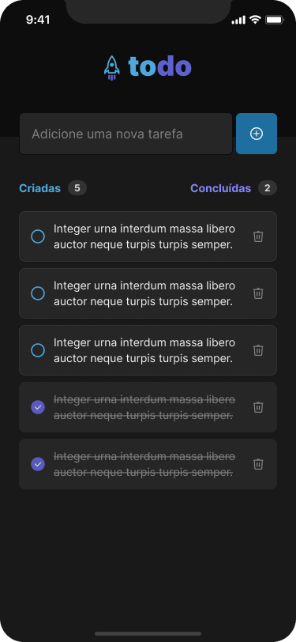

# react-native-task-manager

This project was generated with [Expo CLI](https://github.com/expo/expo-cli) version 6.0.8

This app allow you to manage tasks in the best to-do list style

## Features
- Add a new task
- Check and uncheck a task completed
- Remove a task from the list
- Show progress of completing tasks

## Layout

  
  
  

## Running project

Run `npm install` to install all project dependencies and run `npm start` to execute the app. This command will generate a QR Code to you scan an run the app on your smartphone since it and the computer been the same Wi-fi network ou simply run the app in your favorite Android emulator from your computer.
